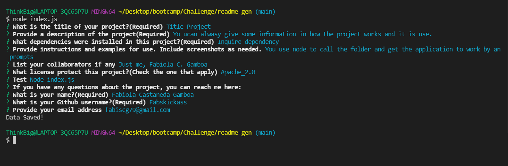
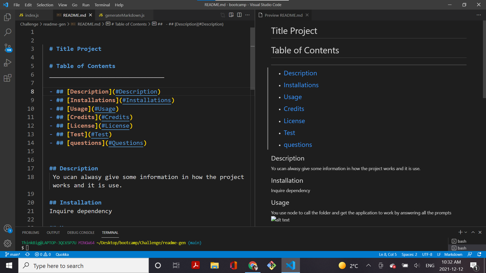

  
  # Title Project

  # Table of Contents
  _________________________________

  - ## [Description](#Description)
  - ## [Installations](#Installations)
  - ## [Usage](#Usage)
  - ## [Credits](#Credits)
  - ## [License](#License)
  - ## [Test](#Test)
  - ## [questions](#Questions)
 

  ## Description
   Yo ucan alwasy give some information in how the project works and it is use.

  ## Installation
  Inquire dependency

  ## Usage
  You use node to call the folder and get the application to work by answering all the prompts 
   

  
  

  # Credits

  undefined

  ## License
  
  

  # Questions
  _________________________________

  ## If you have any further questions about this project, you can always contact me here:

  ## Name
  Fabiola Castaneda Gamboa

  ## [Github](https://github.com/Fabskickass)
  

  ## [Email](fabiscg79@gmail.com)

